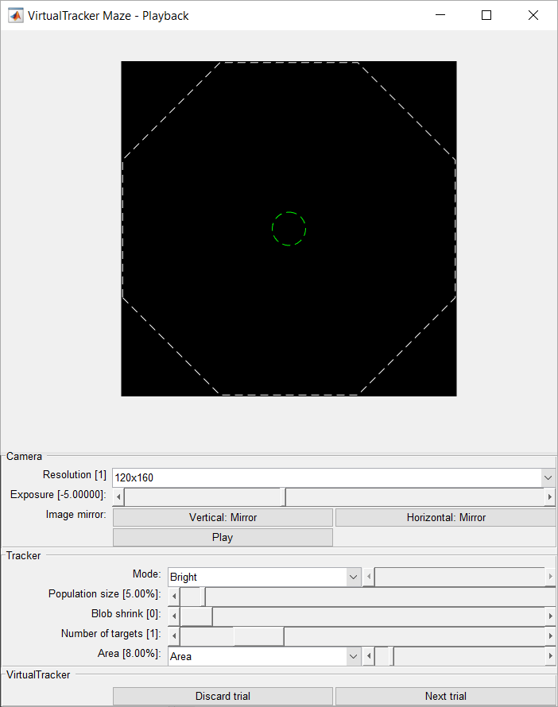

# Virtual Tracker
Controller for 2D tasks relaying on video tracking.
One or more targets can be tracked with a overhead camera which may invoke callbacks when they enter virtual zones on a trial basis.

Examples are provided to trigger tones in single zone or multi-zone tasks (VirtualTracker.example) and for a method to synchronice an external device to a webcam via an Arduino micro-controller (TrackerSync).

## Prerequisites
* [MATLAB][MATLAB] (last tested with R2018a)

## Installation
* Install MATLAB
	* Download library from repository and place the MATLAB folder under Documents folder.
	* Create/modify Documents/MATLAB/startup.m and put `addpath('Tools');`
	
## Usage examples

### Example - Reach target to play a sound


To execute this example run `VideoTracker.example` in MATLAB.
A GUI will pop-up, hit Play and adjust settings to capture one object with the camera.
When the target hits the overlaid zones, a tone associated to the zone will be played. Press Next Trial to load a previously defined zone or set of zones.

### Example - Synchronize a subject position to the frame trigger of a micro-endoscopic camera.
To execute this example run `TrackerSync(comId)` in MATLAB, where comId is the name of the serial port of an Arduino micro-controller. The Arduino must be running the firmware provided [here][DigitalInputs].
A GUI will pop-up, hit Play and adjust settings to capture one object with the camera.
Every frame that the micro-endoscopic camera sends is relayed by the Arduino and captured by TrackerSync to continuosly log to disk the position of the subject.
Camera and tracker settings will be saved automatically for future sessions.

### Example - VirtualTracker.GUI
```matlab
VirtualTracker with UI components. Target zones with callbacks may be passed for processing and rendering.

% Example 1 - a unique zone for all trials:
  region = [0, 0, 0.1];
  callback = @(data)fprintf('Inside: %i\n', data.State);
  zone = {1, region, callback};
  obj = VirtualTracker.GUI();
  obj.zones = zone;

% Example 2 - one zone for odd trials, another zone for even trials:
  zones = {1, [-0.1, -0.1, +0.1], @(data)fprintf('zone 1: %i\n', data.State), ...
           2, [+0.1, +0.1, +0.1], @(data)fprintf('zone 2: %i\n', data.State)};
  obj = VirtualTracker.GUI();
  obj.zones = zones;

% Example 3 - two zones, one zone, another zone, repeat:
  zones = {1, [-0.1, -0.1, +0.1], @(data)fprintf('zone 1.1: %i\n', data.State), ...
           1, [+0.1, +0.1, +0.1], @(data)fprintf('zone 1.2: %i\n', data.State), ...
           8, [+0.1, +0.1, +0.1], @(data)fprintf('zone 8: %i\n', data.State)  , ...
           9, [+0.0, +0.0, +0.0], @(data)fprintf('zone 9: %i\n', data.State)};
  obj = VirtualTracker.GUI();
  obj.zones = zones;
```

### Example - Target
```matlab
% Invoke functions when a test position lands within previously defined regions.
obj = Target();
zone1 = [0.50, 1.00, 1.00, 0.50
         0.50, 0.50, 1.00, 1.00];
zone2 = [0.25, 0.75, 0.75, 0.25
         0.25, 0.25, 0.75, 0.75];
h1 = obj.add(zone1(1:2:end), zone1(2:2:end), 0.01, {@(message, data)fprintf(message, data.X, data.Y), '>> Hit zone 1 at (%.2f, %.2f)\n'});
h2 = obj.add(zone2(1:2:end), zone2(2:2:end), 0.01, {@(message, data)fprintf(message, data.Y, data.Y), '>> Hit zone 2 at (%.2f, %.2f)\n'});

disp('Aim to nothing:');
obj.test(0.00, 0.00);

disp('Aim to zone 1 only:');
obj.test(1.00, 1.00);

disp('Aim to zone 2 only:');
obj.test(0.25, 0.25);

disp('Aim to both zones:');
obj.test(0.50, 0.50);

disp('Delete zone 1 and repeat:');
delete(h1);
obj.test(0.50, 0.50);
```

## API Reference
While these libraries acquire a better shape, look at the documentation from within MATLAB: Type help followed by the name of any class (those files copied to Documents/MATLAB). Most classes list methods and properties with links that expand their description. For example type `help VirtualTracker.GUI`.

## Version History
### 0.1.0
* Initial Release: Library and example code

## License
© 2018 [Leonardo Molina][Leonardo Molina]

This project is licensed under the [GNU GPLv3 License][LICENSE.md].

[Leonardo Molina]: https://github.com/leomol
[DigitalInputs]: Arduino/DigitalInputs
[MATLAB]: https://www.mathworks.com/downloads/
[LICENSE.md]: LICENSE.md